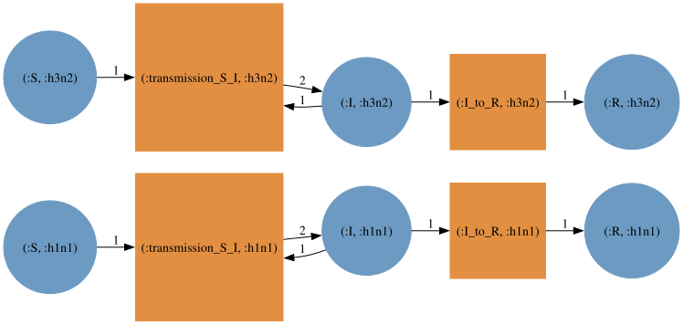
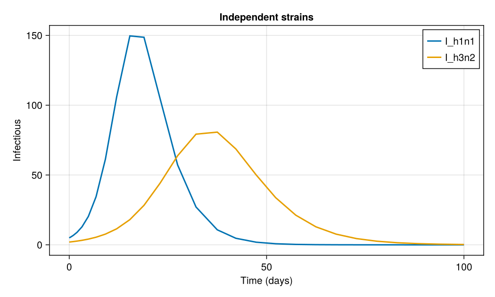
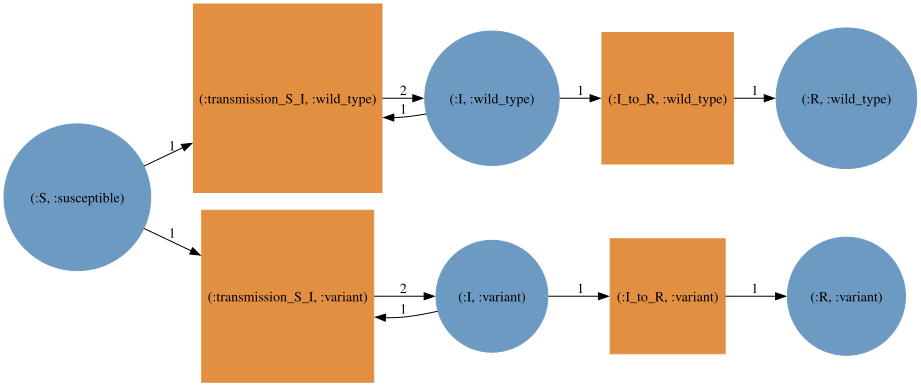
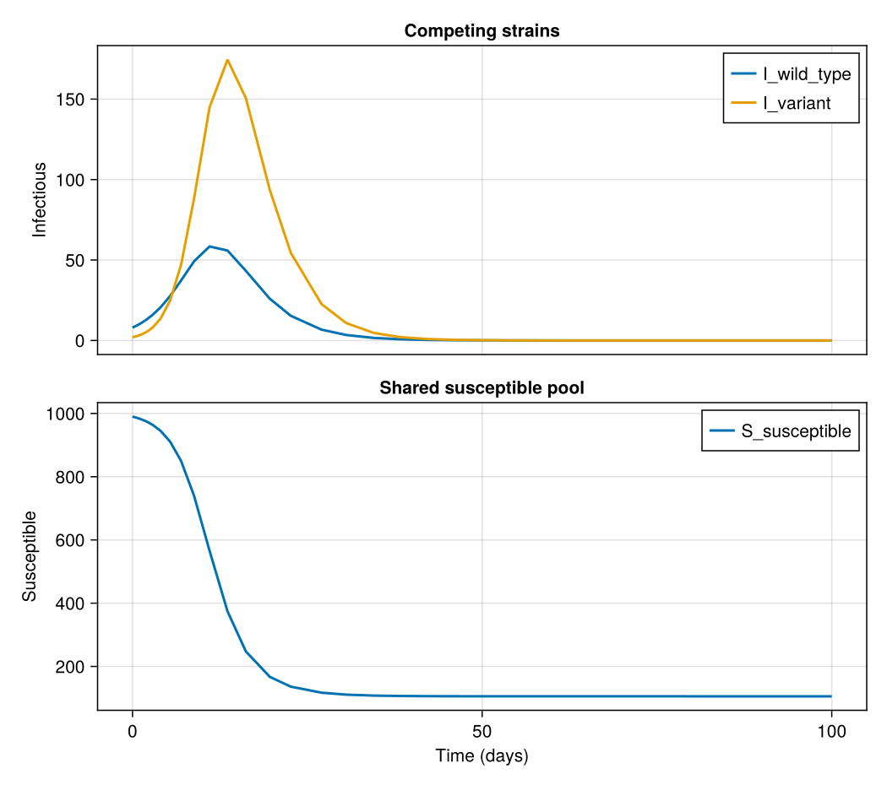
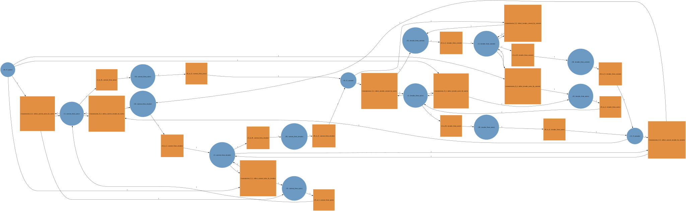
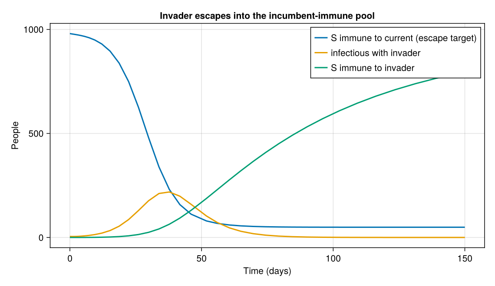

# Multistrain models and immune history

Strain structure is another factor in a `typed_product`.
How strains interact is decided by the typing that the disease model and the strain model share:

  | Strain model            | Typing                     | Strains                                                     |
  | ----------------------- | -------------------------- | ----------------------------------------------------------- |
  | `NoCrossImmunity`       | `OnePopulationTyping`      | circulate independently (e.g. influenza subtypes)           |
  | `CompleteCrossImmunity` | `UninfectedInfectedTyping` | compete for one susceptible pool (e.g. SARS-CoV-2 variants) |
  | `ImmuneHistory`         | `UninfectedInfectedTyping` | partial escape, tracked by each person's infection history  |

```julia
using AlgebraicEpiMech
using AlgebraicPetri
using AlgebraicPetri.TypedPetri: typed_product
using Catlab
using CairoMakie
using LabelledArrays
using OrdinaryDiffEqTsit5
using SymbolicIndexingInterface: SymbolCache

function solve_net(pn, u0, p, tspan)
    f = ODEFunction(vectorfield_flat(pn); sys = SymbolCache(collect(keys(u0))))
    return solve(ODEProblem(f, u0, tspan, p), Tsit5())
end


function plot_solution!(ax, sol, names)
    for name in names
        lines!(ax, sol.t, sol[name]; label = string(name), linewidth = 2)
    end
    axislegend(ax; position = :rt)
    return ax
end
```

## Independent strains

With one population type every compartment is replicated per strain and nothing couples the copies.

```julia
typing = OnePopulationTyping()
independent = dom(typed_product(create_model(typing, SIR()), create_model(typing, NoCrossImmunity([:h1n1, :h3n2]))))
(species = flatten_symbols.(snames(independent)), transitions = flatten_symbols.(tnames(independent)))
```

```
(species = [:S_h1n1, :S_h3n2, :I_h1n1, :I_h3n2, :R_h1n1, :R_h3n2], transitions = [:transmission_S_I_h1n1, :I_to_R_h1n1, :transmission_S_I_h3n2, :I_to_R_h3n2])
```

```julia
to_graphviz(independent)
```


```julia
N = 1000.0
u0 = LVector(S_h1n1 = N - 5.0, I_h1n1 = 5.0, R_h1n1 = 0.0, S_h3n2 = N - 2.0, I_h3n2 = 2.0, R_h3n2 = 0.0)
p = LVector(transmission_S_I_h1n1 = 0.6 / N, I_to_R_h1n1 = 0.3, transmission_S_I_h3n2 = 0.4 / N, I_to_R_h3n2 = 0.25)
sol = solve_net(independent, u0, p, (0.0, 100.0))
fig = Figure(size = (700, 420))
ax = Axis(fig[1, 1]; xlabel = "Time (days)", ylabel = "Infectious", title = "Independent strains")
plot_solution!(ax, sol, [:I_h1n1, :I_h3n2])
fig
```


## Competing strains

`UninfectedInfectedTyping` gives uninfected and infected compartments different types, so the strain model can leave `S` unstratified.
All strains then draw on one shared susceptible pool, and recovery from either strain protects against both.

```julia
ui_typing = UninfectedInfectedTyping(uninfected_type = :Susceptible, infected_type = :Infectious)
competing = dom(typed_product(create_model(ui_typing, SIR()), create_model(ui_typing, CompleteCrossImmunity([:wild_type, :variant]))))
(species = flatten_symbols.(snames(competing)), transitions = flatten_symbols.(tnames(competing)))
```

```
(species = [:S_susceptible, :I_wild_type, :I_variant, :R_wild_type, :R_variant], transitions = [:transmission_S_I_wild_type, :I_to_R_wild_type, :transmission_S_I_variant, :I_to_R_variant])
```

```julia
to_graphviz(competing)
```


The variant is more transmissible but starts behind.

```julia
u0_c = LVector(S_susceptible = N - 10.0, I_wild_type = 8.0, I_variant = 2.0, R_wild_type = 0.0, R_variant = 0.0)
p_c = LVector(transmission_S_I_wild_type = 0.5 / N, I_to_R_wild_type = 0.25, transmission_S_I_variant = 0.8 / N, I_to_R_variant = 0.3)
sol_c = solve_net(competing, u0_c, p_c, (0.0, 100.0))
fig = Figure(size = (700, 620))
ax_infected = Axis(fig[1, 1]; ylabel = "Infectious", title = "Competing strains")
ax_susceptible = Axis(fig[2, 1]; xlabel = "Time (days)", ylabel = "Susceptible", title = "Shared susceptible pool")
plot_solution!(ax_infected, sol_c, [:I_wild_type, :I_variant])
plot_solution!(ax_susceptible, sol_c, [:S_susceptible])
linkxaxes!(ax_infected, ax_susceptible)
hidexdecorations!(ax_infected; grid = false)
fig
```


## Immune history

`ImmuneHistory` is a stratification over `UninfectedInfectedTyping` that tracks which strains each susceptible is immune to.
After composition, susceptibles are indexed by an immune class `h` and the infected compartments by `(h, i)`: prior history and infecting strain.
Two behaviours follow from the product rather than being coded:

1. **Escape**: a class immune to the strain set `h` has transmission transitions only for strains outside `h`.
2. **History update on reversion**: the only move between classes is reversion `R → S`, which sends `(h, i)` to `h ∪ {i}` with `FullHistory()` ($2^n$ classes) or to `{i}` with `LatestInfection()` ($n + 1$ classes).
   Immunity is gained on rejoining `S`, not on leaving it.

```julia
ui = UninfectedInfectedTyping()
seirs = create_model(ui, SEIRS())
latest = dom(typed_product(seirs, create_model(ui, ImmuneHistory([:current, :invader]; mode = LatestInfection()))))
(species = sort(flatten_symbols.(snames(latest))), transitions = sort(flatten_symbols.(tnames(latest))))
```

```
(species = [:E_current_from_invader, :E_current_from_naive, :E_invader_from_current, :E_invader_from_naive, :I_current_from_invader, :I_current_from_naive, :I_invader_from_current, :I_invader_from_naive, :R_current_from_invader, :R_current_from_naive, :R_invader_from_current, :R_invader_from_naive, :S_U_current, :S_U_invader, :S_U_naive], transitions = [:E_to_I_current_from_invader, :E_to_I_current_from_naive, :E_to_I_invader_from_current, :E_to_I_invader_from_naive, :I_to_R_current_from_invader, :I_to_R_current_from_naive, :I_to_R_invader_from_current, :I_to_R_invader_from_naive, :R_to_S_current_from_invader, :R_to_S_current_from_naive, :R_to_S_invader_from_current, :R_to_S_invader_from_naive, :transmission_S_I_infect_current_invader_by_invader, :transmission_S_I_infect_current_invader_by_naive, :transmission_S_I_infect_current_naive_by_invader, :transmission_S_I_infect_current_naive_by_naive, :transmission_S_I_infect_invader_current_by_current, :transmission_S_I_infect_invader_current_by_naive, :transmission_S_I_infect_invader_naive_by_current, :transmission_S_I_infect_invader_naive_by_naive])
```

```julia
to_graphviz(latest)
```


Read the escape off the graph: `S_U_current` (immune to the incumbent) is infected by the invader into `E_invader_from_current`, and has no transition for infection by `current`.
Recovery leads to `R_invader_from_current`, and reversion folds the strain into the history, here overwriting it to `S_U_invader`.

With `FullHistory()` (the default) immunity accumulates instead, so the same recovered compartment reverts to `S_U_current_invader`, immune to both.

```julia
full = dom(typed_product(seirs, create_model(ui, ImmuneHistory([:current, :invader]))))
(species = ns(full), transitions = nt(full))
```

```
(species = 16, transitions = 20)
```

### Escape in a mostly immune population

Seed a population that is almost entirely immune to the incumbent, with a small invader introduction and no incumbent circulating.
Under complete cross-immunity nothing could grow; here the invader escapes into `S_U_current`.
Rates are set by transition role.

```julia
species = flatten_symbols.(snames(latest))
transitions = flatten_symbols.(tnames(latest))

u0_h = LVector(; (s => 0.0 for s in species)...)
u0_h.S_U_current = N - 20.0
u0_h.S_U_naive = 15.0
u0_h.I_invader_from_naive = 5.0

β = Dict(:current => 0.30, :invader => 0.45)
function rate(t)
    s = string(t)
    occursin("infect_current", s) && return β[:current] / N
    occursin("infect_invader", s) && return β[:invader] / N
    startswith(s, "E_to_I") && return 1 / 3
    startswith(s, "I_to_R") && return 1 / 7
    startswith(s, "R_to_S") && return 1 / 60
    error("unmapped transition $t")
end
p_h = LVector(; (t => rate(t) for t in transitions)...)

sol_h = solve_net(latest, u0_h, p_h, (0.0, 150.0))
invader = sol_h[:I_invader_from_naive] .+ sol_h[:I_invader_from_current]
fig = Figure(size = (760, 440))
ax = Axis(fig[1, 1]; xlabel = "Time (days)", ylabel = "People", title = "Invader escapes into the incumbent-immune pool")
lines!(ax, sol_h.t, sol_h[:S_U_current]; label = "S immune to current (escape target)", linewidth = 2)
lines!(ax, sol_h.t, invader; label = "infectious with invader", linewidth = 2)
lines!(ax, sol_h.t, sol_h[:S_U_invader]; label = "S immune to invader", linewidth = 2)
axislegend(ax; position = :rt)
fig
```


The invader wave drains `S_U_current`, and recovereds move on to `S_U_invader`: escape arises from the composition, with no seeded pulse.
Swapping `SEIRS()` for any other template, for example `SEIRS(number_I_stages = 3)`, composes with the same immune-history factor, and observation can be attached to the composed net with `attach_observation`.
