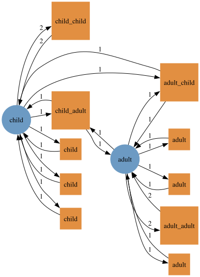
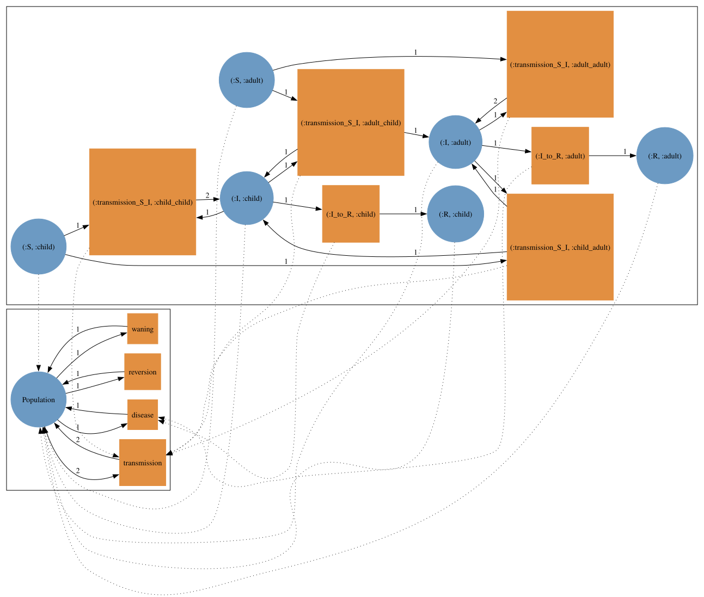
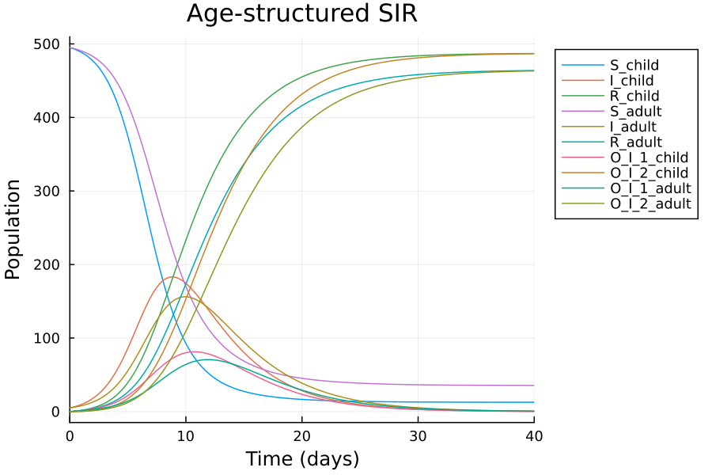
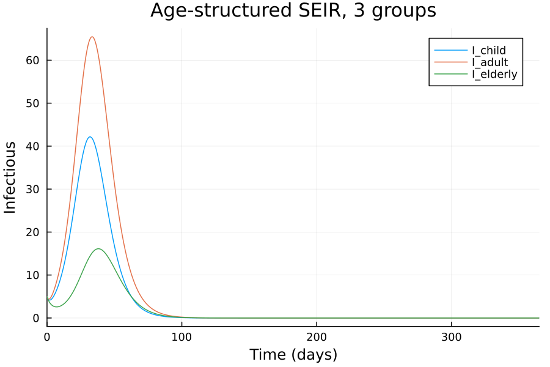
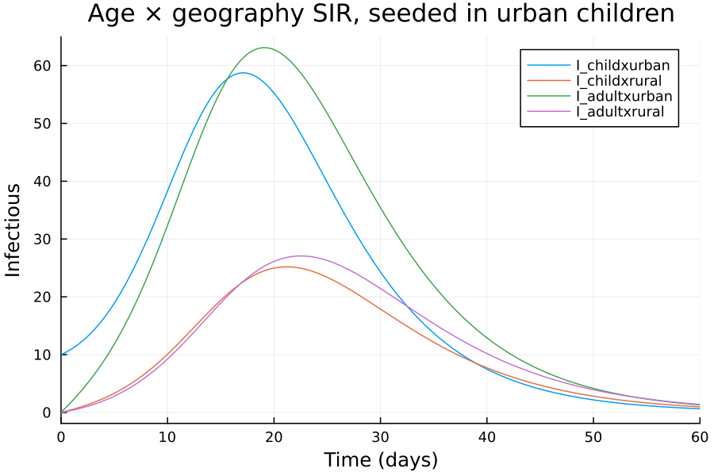

# Stratified models

Stratification by age, place or risk group is not written by hand: a disease model and a stratification model are built separately over the same typing and combined with `typed_product`, the pullback over the type system.
Every compartment is replicated per stratum, disease progression happens within each stratum, and transmission gets one transition per (infectee, infector) pair of strata: a full contact matrix.

```julia
using AlgebraicEpiMech
using AlgebraicPetri
using AlgebraicPetri.TypedPetri: typed_product
using Catlab
using LabelledArrays
using OrdinaryDiffEqTsit5
using Plots
using SymbolicIndexingInterface: SymbolCache

function solve_net(pn, u0, p, tspan)
    f = ODEFunction(vectorfield_flat(pn); sys = SymbolCache(collect(keys(u0))))
    return solve(ODEProblem(f, u0, tspan, p), Tsit5())
end
```

## Age-structured SIR

The disease model and a two-group age stratification, both typed over `OnePopulationTyping`.

```julia
typing = OnePopulationTyping()
sir = create_model(typing, SIR())
age = AgeStratification([:child, :adult])
age_model = create_model(typing, age)
tnames(dom(age_model))
```

```
10-element Vector{Symbol}:
 :child_child
 :child_adult
 :adult_child
 :adult_adult
 :child
 :child
 :child
 :adult
 :adult
 :adult
```

The stratification's transmission transitions are named `infectee_infector`.
It also carries reflexive transitions (`:child`, `:adult`) for the non-transmission types, so that `typed_product` keeps recovery (and progression, waning and observation) within each group.

```julia
to_graphviz(dom(age_model))
```


The product has three compartments per age group, four transmission transitions and one recovery per group.

```julia
age_sir = typed_product(sir, age_model)
to_graphviz(age_sir)
```


Observation is attached after composition.
`attach_observation` is a pushout, not a factor of the product, so it has to come last; each age group then gets its own delay chain.

```julia
age_sir_pn = attach_observation(dom(age_sir), AtCompartment(:I); n_stages = 2)
(species = flatten_symbols.(snames(age_sir_pn)), transitions = flatten_symbols.(tnames(age_sir_pn)))
```

```
(species = [:S_child, :S_adult, :I_child, :I_adult, :R_child, :R_adult, :O_I_1_child, :O_I_2_child, :O_I_1_adult, :O_I_2_adult], transitions = [:transmission_S_I_child_child, :transmission_S_I_child_adult, :transmission_S_I_adult_child, :transmission_S_I_adult_adult, :I_to_R_child, :I_to_R_adult, :O_I_1_to_O_I_2_child, :obs_inflow_I_child_child, :O_I_1_to_O_I_2_adult, :obs_inflow_I_adult_adult])
```

Species and transition names are tuples such as `(:S, :child)`; `vectorfield_flat` flattens them with underscores, which gives the names used in the state and parameter vectors below.

```julia
N_child, N_adult = 500.0, 500.0
u0 = LVector(
    S_child = N_child - 5.0, I_child = 5.0, R_child = 0.0,
    S_adult = N_adult - 5.0, I_adult = 5.0, R_adult = 0.0,
    O_I_1_child = 0.0, O_I_2_child = 0.0, O_I_1_adult = 0.0, O_I_2_adult = 0.0,
)
β = 0.5
p = LVector(;
    transmission_S_I_child_child = β * 1.5 / N_child,
    transmission_S_I_child_adult = β * 0.8 / (N_child + N_adult),
    transmission_S_I_adult_child = β * 0.8 / (N_child + N_adult),
    transmission_S_I_adult_adult = β * 1.0 / N_adult,
    I_to_R_child = 0.25, I_to_R_adult = 0.25,
    O_I_1_to_O_I_2_child = 0.5, O_I_1_to_O_I_2_adult = 0.5,
    (t => 0.25 for t in flatten_symbols.(tnames(age_sir_pn)) if startswith(string(t), "obs_inflow"))...,
)
sol = solve_net(age_sir_pn, u0, p, (0.0, 40.0))
plot(sol; xlabel = "Time (days)", ylabel = "Population", title = "Age-structured SIR", legend = :outertopright)
```


## Setting a contact matrix programmatically

The transition names follow a fixed pattern, so parameters for larger models can be generated from a contact matrix instead of written out.
Here is an SEIR model with three age groups.

```julia
groups = [:child, :adult, :elderly]
population = Dict(:child => 300.0, :adult => 500.0, :elderly => 200.0)
contact = [
    2.0 1.0 0.3
    1.0 1.2 0.5
    0.3 0.5 0.6
]
N = sum(values(population))

age3_seir_pn = dom(typed_product(create_model(typing, SEIR()), create_model(typing, AgeStratification(groups))))

transmission = [
    Symbol("transmission_S_I_$(a)_$(b)") => 0.5 * contact[i, j] / N
        for (i, a) in enumerate(groups) for (j, b) in enumerate(groups)
]
progression = [Symbol("$(t)_$(g)") => rate for (t, rate) in (("E_to_I", 0.25), ("I_to_R", 0.2)) for g in groups]
p3 = LVector(; transmission..., progression...)

u03 = LVector(; (
    Symbol("$(c)_$(g)") => (c == :S ? population[g] - 5.0 : c == :I ? 5.0 : 0.0)
        for g in groups for c in (:S, :E, :I, :R)
)...)
sol3 = solve_net(age3_seir_pn, u03, p3, (0.0, 365.0))
plot(sol3; idxs = [Symbol("I_$g") for g in groups], xlabel = "Time (days)", ylabel = "Infectious",
    title = "Age-structured SEIR, 3 groups")
```


## Stacking stratifications

Contact stratifications compose with `*` (or `compose_stratifications`).
Two age groups times two locations gives four product strata and a 4×4 contact matrix.

```julia
geo = GeographicStratification([:urban, :rural])
age_geo = age * geo
(strata = age_geo.stratum_names, label = age_geo.label)
```

```
(strata = [:childxurban, :childxrural, :adultxurban, :adultxrural], label = :age_x_geography)
```

Building the model from the product stratification is equivalent to composing sequentially.

```julia
age_geo_sir = dom(typed_product(sir, create_model(typing, age_geo)))
sequential = dom(typed_product(typed_product(sir, age_model), create_model(typing, geo)))
(species = ns(age_geo_sir), transitions = nt(age_geo_sir), same_size_as_sequential = (ns(sequential), nt(sequential)) == (ns(age_geo_sir), nt(age_geo_sir)))
```

```
(species = 12, transitions = 20, same_size_as_sequential = true)
```

A separable contact structure (an age factor times a location factor) fills in all 16 transmission rates.

```julia
strata = [(a, g) for a in age.stratum_names for g in geo.stratum_names]
pop = Dict((:child, :urban) => 300.0, (:child, :rural) => 200.0, (:adult, :urban) => 400.0, (:adult, :rural) => 300.0)
N4 = sum(values(pop))
age_mix = Dict((:child, :child) => 2.25, (:child, :adult) => 1.05, (:adult, :child) => 1.05, (:adult, :adult) => 1.0)
geo_mix = Dict((:urban, :urban) => 1.3, (:rural, :rural) => 0.8, (:urban, :rural) => 0.3, (:rural, :urban) => 0.3)
name(a, g) = "$(a)x$(g)"

p4 = LVector(;
    (
        Symbol("transmission_S_I_$(name(a, g))_$(name(b, h))") => 0.4 * age_mix[(a, b)] * geo_mix[(g, h)] / N4
            for (a, g) in strata for (b, h) in strata
    )...,
    (Symbol("I_to_R_$(name(a, g))") => 0.2 for (a, g) in strata)...,
)
u04 = LVector(; (
    Symbol("$(c)_$(name(a, g))") => (c == :S ? pop[(a, g)] : 0.0) for (a, g) in strata for c in (:S, :I, :R)
)...)
u04.S_childxurban -= 10.0
u04.I_childxurban = 10.0

sol4 = solve_net(age_geo_sir, u04, p4, (0.0, 60.0))
plot(sol4; idxs = [Symbol("I_$(name(a, g))") for (a, g) in strata], xlabel = "Time (days)", ylabel = "Infectious",
    title = "Age × geography SIR, seeded in urban children")
```


Final attack rate per stratum:

```julia
Dict(name(a, g) => round(sol4[Symbol("R_$(name(a, g))")][end] / pop[(a, g)]; digits = 3) for (a, g) in strata)
```

```
Dict{String, Float64} with 4 entries:
  "adultxurban" => 0.75
  "adultxrural" => 0.48
  "childxrural" => 0.644
  "childxurban" => 0.891
```

A third factor multiplies again: age × geography × risk has eight strata and 64 transmission rates, so richer stratifications call for structured (for example separable) parameterisations rather than free contact matrices.

```julia
risk = ContactStratification([:low_risk, :high_risk], :risk)
length((age * geo * risk).stratum_names)
```

```
8
```
