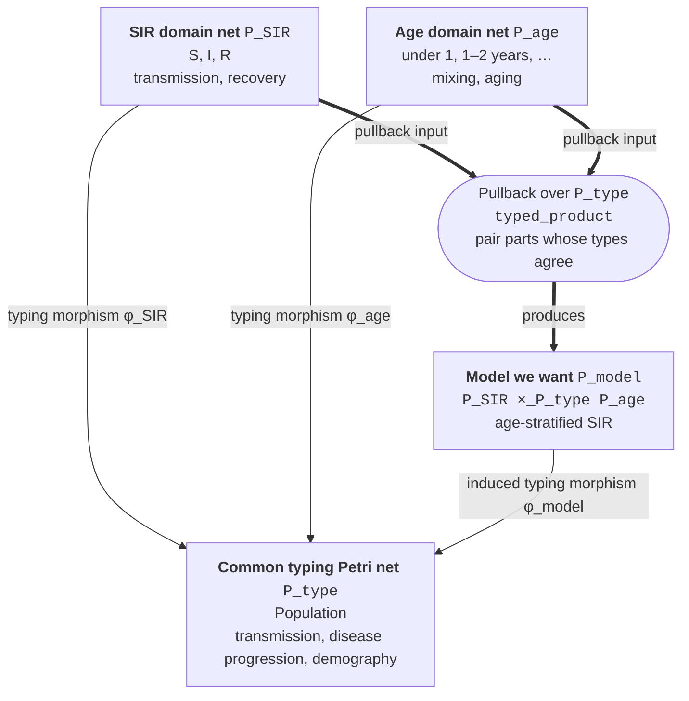
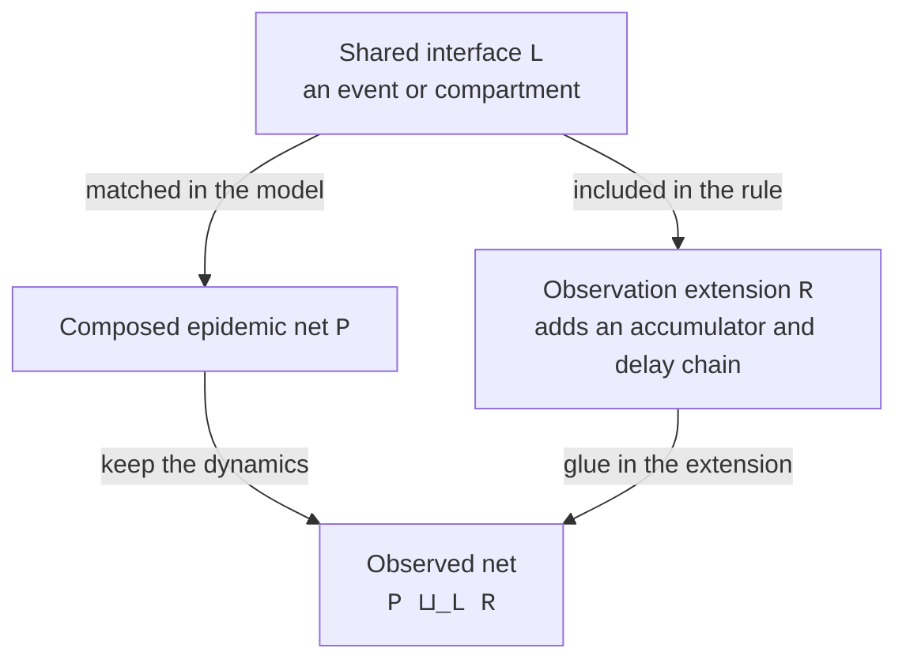

# Getting started

## Installation

The packages need Julia 1.11 or later and are not yet registered.
Add them from GitHub, AlgebraicEpiMech first, because ConfigurableEpi depends on it:

```julia
using Pkg
Pkg.add(url = "https://github.com/CDCgov/AlgebraicEpiModels", subdir = "AlgebraicEpiMech")
Pkg.add(url = "https://github.com/CDCgov/AlgebraicEpiModels", subdir = "ConfigurableEpi")
```

Drawing Petri nets with `to_graphviz` needs the [Graphviz](https://graphviz.org/download/) `dot` executable on the `PATH`.

To work on the packages themselves, clone the repository and instantiate the package you are working on; each package's test environment is a workspace project:

```bash
git clone https://github.com/CDCgov/AlgebraicEpiModels
cd AlgebraicEpiModels
julia --project=ConfigurableEpi -e 'using Pkg; Pkg.instantiate(); Pkg.test()'
```

## The basic idea: composing nets with pullbacks and pushouts

AlgebraicEpiMech uses two complementary ways to combine Petri nets.
A **pullback** matches compatible parts of two models through a shared type system; a **pushout** glues new structure onto a part that two models have in common.

### Typing supplies the join keys

`create_model` returns a *typed* Petri net.
More precisely, it returns a morphism

\[ \phi : P \longrightarrow P\_{\mathrm{type}}, \]

between two Petri nets.
`dom(φ)` is the concrete model \(P\), such as an SIR or age net, while `codom(φ)` is the common type system \(P\_{\mathrm{type}}\).
The morphism maps the domain's species, transitions, and arcs into that codomain while preserving which species each transition consumes and produces.
Typing is therefore more than adding labels to a net: it is a structure-preserving map between the domain and codomain nets.

The codomain acts like a small shared schema.
For example, it can say that a species is a population and that a transition is transmission, disease progression, reversion, or waning.
Two nets typed over the same codomain can then be matched by those roles even when their display names differ.

### Pullback: join compatible structure

Think of two dataframes with a common `type` column.
An inner join forms rows from pairs whose keys agree.
A pullback does the analogous job for structured objects: it pairs species and transitions that map to the same type, while also preserving the Petri-net incidence structure.

Consider two typed Petri nets:

\[ \phi_{\mathrm{SIR}} : P_{\mathrm{SIR}} \longrightarrow P_{\mathrm{type}}, \]

Which types a petri net that defines the SIR compartmental model, for example, each compartment species is typed to a "Population"-type, transmission is typed as a "transmission"-type transition and recovery is typed as a "disease progression"-type transition.
Then consider

\[ \phi_{\mathrm{age}} : P_{\mathrm{age}} \longrightarrow P_{\mathrm{type}}, \]

Which types a petri net that defines a demographic-mixing model of age groups, such as "<1" year old, "1-2" year old etc. The demographic model species can also all be typed to the same "Population"-type, mixing between groups typed to a "transmission"-type transition.
Aging can be typed to a new "demography"-type transition.



The pullback produces the new Petri net \(P_{\mathrm{model}}\), as the domain of the induced morphism

\[ \phi_{\mathrm{model}} : P_{\mathrm{model}} \longrightarrow P_{\mathrm{type}}, \]

which is the age-stratified SIR model we want.
In practical terms, pulling back an SIR net and a two-group age net produces compartments such as `S_child`, `I_child`, `R_child`, `S_adult`, and so on.
Transmission is combined with compatible contact transitions, while recovery is combined with the within-group disease transitions.
This is what `typed_product` computes; the common codomain supplies the join keys.

Why keep the morphism when we only want the domain petri net?
Because we can continue to compose model structures, for example, layering geographic structure, strain dynamics and immune history effects on top of the age-stratified SIR model.

The dataframe analogy is deliberately approximate.
An ordinary join only compares values in columns; a Petri-net pullback must also respect inputs, outputs, and the maps between the two nets and their common type system.

### Pushout: glue along shared structure

A pushout starts from the opposite-looking situation: a shared piece is included in two structures, and the result glues those structures together along that piece.
For dataframes, picture an outer merge in which matching identifiers refer to the same entity: keep the additions from both sides, but represent the matched record only once.



This is the construction behind `attach_observation`.
For `AtEvent(:transmission)`, the shared interface is an infection event and the extension records that same event in an observation accumulator.
For `AtCompartment(:I)`, the shared interface is the infectious compartment and the extension adds a catalytic tap that observes `I` without consuming it.

Observation is attached after the pullback composition.
The pushout therefore sees the final age, location, or strain structure and adds the appropriate observation chain to each resulting stratum; the stratification models do not need to know that observation exists.

## A first model

We build a typed net that represents the SIR model on a homogeneous population with standard types for transitions using `create_model`.
The net that represents the SIR model is the domain the typed Petri net, which is accessible using `dom`.
That net defines a vectorfield which is constructed using `vectorfield_flat`.
This vector field comes with an expectation that input vectors will follow an naming scheme.
We solve it as an ODE, using the `SciML` package `OrdinaryDiffEqTsit5`:

```julia
using AlgebraicEpiMech, AlgebraicPetri, Catlab, LabelledArrays, OrdinaryDiffEqTsit5

pn = dom(create_model(OnePopulationTyping(), SIR()))
snames(pn), tnames(pn)  # ([:S, :I, :R], [:transmission_S_I, :I_to_R])

u0 = LVector(S = 990.0, I = 10.0, R = 0.0)
p = LVector(transmission_S_I = 0.5 / 1000, I_to_R = 0.25)
sol = solve(ODEProblem(vectorfield_flat(pn), u0, (0.0, 120.0), p), Tsit5())
```

## Next steps

[Compartmental models](examples/compartmental_models.md) continues from here towards more complex compartmental models such as SEIR or multiple E/I compartments.
[Stratified models](examples/stratified_models.md) and [Multistrain models and immune history](examples/multistrain_immune_history.md) show how to build other epidemiological models as nets and how the typing of the petri net allows valid compostions via algebraic pullback.

## A first fit

[Inference engines](examples/inference_engines.md) takes a model through the ConfigurableEpi contract: describe it as an `EpiModel`, build an engine with `build_inference`, and call `fit_forecast!` on a count series.
[ConfigurableEpi](packages/configurableepi.md) describes the parts of an `EpiModel` and the run configuration.
