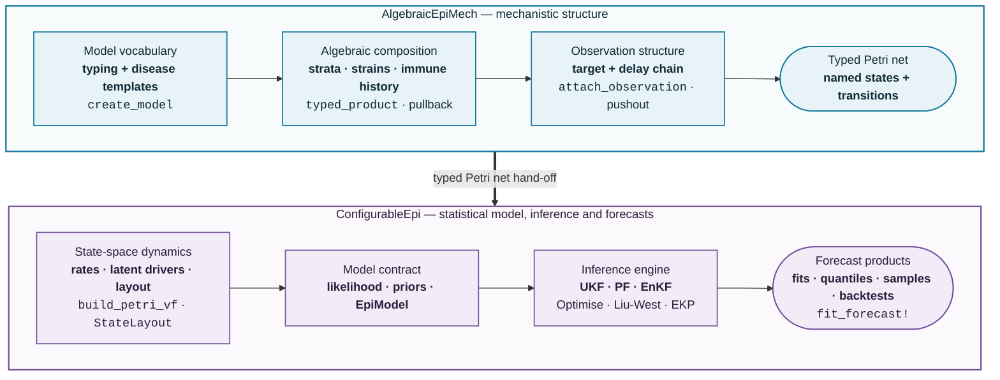

# AlgebraicEpiModels

AlgebraicEpiModels is a pair of Julia packages for building compartmental epidemic models by algebraic composition [Libkind et al. (2023)](https://royalsocietypublishing.org/doi/10.1098/rsta.2021.0309) and fitting them to surveillance data.

  | Package                                          | What it does                                                                                                                                                                                                                                                                                                                                                                               |
  | ------------------------------------------------ | ------------------------------------------------------------------------------------------------------------------------------------------------------------------------------------------------------------------------------------------------------------------------------------------------------------------------------------------------------------------------------------------ |
  | [AlgebraicEpiMech](packages/algebraicepimech.md) | Builds compartmental models as typed Petri nets (*nets*) by algebraic compostions: 1) **Algebraic pullback** combines template models, such as SIR and SEIRS, with stratification models, and models of multistrain and immune-history structure. 2) **Algebraic pushout** which combine core composed models with observation delay chains. Any composed net becomes an ODE vector field. |
  | [ConfigurableEpi](packages/configurableepi.md)   | Turns an AlgebraicEpiMech net into a stochastic state-space model with latent drivers and an observation model, then fits it to a count series using filtering methods and gives utilities for forecasting.                                                                                                                                                                                |

## How the pieces fit

AlgebraicEpiMech governs the structure of the epidemic and surveillance mechanism, producing a Petri net whose species and transitions have predictable, unique names.
That net is the package boundary: ConfigurableEpi supplies its rates, latent processes and statistical observation model, then fits and forecasts it.

## Where next

- [Getting started](getting-started.md): installation and a first model.
- [Examples](examples/compartmental_models.md): executed walkthroughs, from building models to fitting and forecasting.
- API reference for [AlgebraicEpiMech](api/algebraicepimech.md) and [ConfigurableEpi](api/configurableepi.md).
