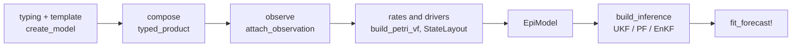

# AlgebraicEpiModels

AlgebraicEpiModels is a pair of Julia packages for building compartmental epidemic models by composition and fitting them to surveillance data.

  | Package                                          | What it does                                                                                                                                                                                                                                                                                                                                                                   |
  | ------------------------------------------------ | ------------------------------------------------------------------------------------------------------------------------------------------------------------------------------------------------------------------------------------------------------------------------------------------------------------------------------------------------------------------------------ |
  | [AlgebraicEpiMech](packages/algebraicepimech.md) | Builds compartmental models as typed Petri nets: templates such as SIR and SEIRS, stratification by age, place or risk, multistrain and immune-history structure, and observation delay chains, composed with the algebraic framework of [Libkind et al. (2023)](https://royalsocietypublishing.org/doi/10.1098/rsta.2021.0309). Any composed net becomes an ODE vector field. |
  | [ConfigurableEpi](packages/configurableepi.md)   | Turns an AlgebraicEpiMech net into a stochastic state-space model with latent drivers and an observation model, then fits it to a count series and forecasts with an unscented Kalman filter, a particle filter or an ensemble Kalman filter.                                                                                                                                  |

## How the pieces fit

The first three steps belong to AlgebraicEpiMech and give a Petri net whose species and transitions have predictable, unique names.
ConfigurableEpi attaches rate functions, stochastic latent processes and an observation model to that net, and runs inference.

## Where next

- [Getting started](getting-started.md): installation and a first model.
- [Examples](examples/compartmental_models.md): executed walkthroughs, from building models to fitting and forecasting.
- API reference for [AlgebraicEpiMech](api/algebraicepimech.md) and [ConfigurableEpi](api/configurableepi.md).
